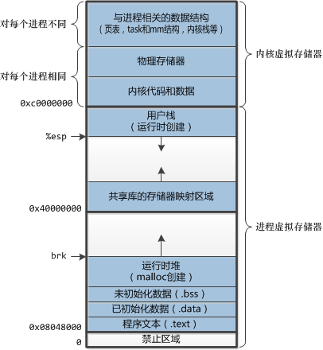
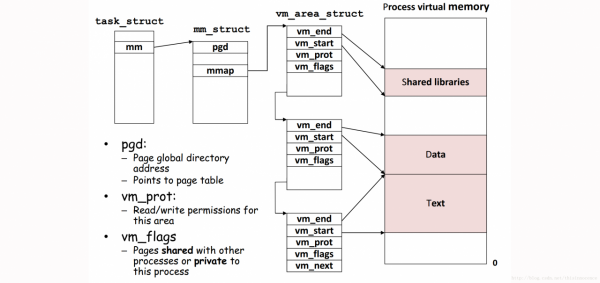

#### char, int, long, long long, double, float, 指针分别占几个字节
注意*long*型和*指针*类型在32位系统和64位系统长度不一样。
|Type|32 Bit| 64Bit|
|-------|--------|---------|
|char|1|1|
|int|4|4|
|long|4|8|
|long long|8|8|
|float|4|4|
|double|8|8|
|\*ptr|4|8|

#### 什么是上下文切换
CPU上下文切换是指CPU保存当前CPU寄存器和程序计数器的值，然后加载下一个上下文的内容， 并调到程序计数器指向的指令继续运行。

- 进程上下文切换 
- 线程上下文切换
- 中断上下文切换

[CPU上下文切换](https://www.jianshu.com/p/4393a4537eca)

#### 如果一个程序运行所需要的内存大于操作系统内存，怎么办
内核的虚拟内存技术可以分配给每个进程最大4G点虚拟内存，当程序运行到指定的虚拟内存时，才会真正分配实际物理内存，并且内核会把不常用的内存替换到磁盘上去。

#### 操作系统的分段和分页
- 32位的操作系统为每个进程分配4G的虚拟内存，一个进程把这4G的内存分成不同的段，分别为1G的内核段，代码(text)段，BSS段，data段，堆和栈。

- 每个进程都有一个task_struct，这个结构体里存放运行该进程所需要的所有信息（PID，指向用户栈的指针，可执行目标文件的名字以及程序计数器[PC指针，被打断后下一条代码的位置]。
- task_struct里有一条指向mm_struct，里面的pgd是指页表（虚拟地址与物理地址的映射），mmap指向一个vm_area_struct，里面存放了每个段的信息。

- 分页是指计算机把内存分成了许多的page，其中有一级page，二级page和三级page，便于查找和管理，更重要的是节省映射表的存储空间。

#### 页面置换算法
- FIFO 先进先出
- LRU 最近最少使用算法 - 通过双向链表（插入、删除）和哈希表（查找）实现，算法略复杂
- LFU 最少使用次数算法
- OPT 最优置换算法

#### Linux缺页异常处理
当MMU在试图翻译某个虚拟地址时，触发了一个缺页，内核的缺页处理程序会：
1. 检查vm_area_struct中的vm_start和vm_end，如果不在范围内，会触发segment fault。
2. 检查是否在访问一个无权访问或者对只读内容进行写操作的行为，如果是，会触发保护异常。
3. MMU判断它为一个正常缺页，MMU会在物理内存找一块内存，并把mapping表更新，CPU重新执行这个指令。

#### 什么是缓冲区溢出
- 缓冲区溢出是指当计算机向缓冲区填充数据时超出了缓冲区本身的容量，发生了踩踏。
- 会导致程序崩溃

#### 进程同步有哪几种机制
- 管程
- 原子操作
- 信号量
- 自旋锁
- 会合
- 分布式系统
[进程同步与通信](https://www.cnblogs.com/youngforever/p/3250270.html)

#### 操作系统的四个特性
- 并发：同一时段内多个程序执行。（注意与并行的区别，并行指同一时刻多个事件）
- 共享：系统中的资源可以被内存中多个并发执行的进程共同使用。
- 虚拟：通过时分复用（分时系统）以及空分复用（虚拟内存）技术实现把一个物理实体虚拟为多个。
- 异步：系统中的进程是以走走停停的方式执行的，且速度不可预知。

#### 用户态和内核态的区别
- 内核态：CPU可以访问内存的所有数据，包括外围设备，也可以将自己从一个程序切换到另一个程序。
- 用户态：只能受限地访问内存，且不允许访问外围设备。
程序如果要访问内核态（如IO操作），需要发送一个中断陷入到内核态（这里CPU也需要进行上下文切换，但不会进程切换）进行系统调用，执行完后再切回用户态。

#### 什么是临界区，如何解决冲突
每个进程中访问临界资源的那段程序称为临界区。
- 如果有多个进程要求进入空闲的临界区，一次只允许一个进程进入。
- 任何时候，处于临界区的进程不可多于一个，其它进程必须等待。
- 进入临界区的进程必须在有限时间内退出。
- 如果进程不能进入自己的临界区，必须让出CPU。

#### 守护进程、僵尸进程、孤儿进程
- 守护进程：运行在后台的一种特殊进程，独立于控制终端并周期性地执行某些任务。
- 僵尸进程：父进程fork子进程，当子进程退出后，父进程没有wait/waitpid子进程，子进程的进程描述符会依然保留在系统中，这样的进程称为僵尸进程。
  - ps命令会打印出僵尸进程，但无法用kill杀死
  - 僵尸进程占用了PID、退出码，当PID耗尽后，就无法再创建新进程。
  - 父进程退出后，僵尸进程变成孤儿进程，init进程会自动接手这个子进程，最终会被清除掉。
- 孤儿进程：一个父进程退出后，它的一个或多个子进程还在运行。

#### 静态链接和动态链接
- 静态链接是在编译的时候链接，把外部函数库拷贝到可执行文件中，优点是适用范围广，缺点是安装包比较大。
- 动态链接是在运行时候引用，安装包较小，多个应用程序可以共享库文件，缺点是用户必须事先安装好指定版本的库文件放到指定位置，否则不能运行。

#### Linux系统上电后的启动过程
- CPU从指定的CS:IP处启动BIOS
- BIOS自检：检查硬件设备
- 初始化设备：设置中断向量表和中断程序
- 搜索启动设备：一般在硬盘里
- 找到BootLoader，加在到内存中（一般可以在这里加code做一些希望在内核启动前做的事情）
- 解压内核image，设置堆栈，把image导入到内存中
- 进入保护模式，初始化
- 启动内核，启动init进程
- 启动rc.sysinit
- 启动rc.local
- 启动/bin/login

#### 大端字节序与小端字节序
- 大端 0x 12 34 56 78
- 小端 0x 78 56 34 12

